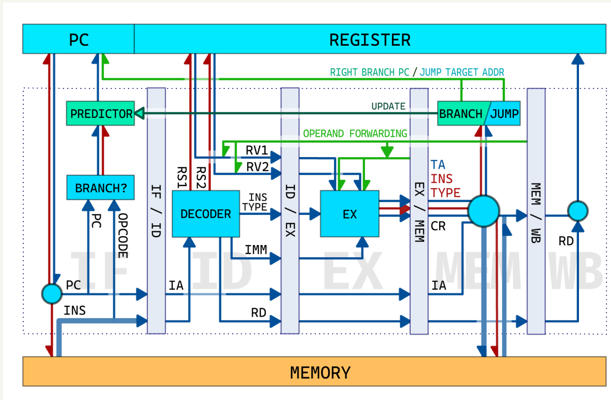

# RISC-V_CPU_Simulator

两个分支main与simple_verify:
simple_verify分支为不加流水的简易模拟器用来做验证.
main分支实现了五级流水;分支预测采用Two-Level Adaptive Branch Prediction,架构图如下:

架构图出处:https://acm.sjtu.edu.cn/wiki/File:Pipeline(2023).pdf

分支预测参考资料:https://zhuanlan.zhihu.com/p/504327998

处理三种冒险时,使用bubble处理structural hazard,使用forward处理data hazard,使用分支预测处理control hazard.

预测结果（acc很多较低，分支预测算法还待优化）

array_test1.data

ans: 123 acc: 0.545455 total: 22 correct: 12

array_test2.data

ans: 43 acc: 0.5 total: 26 correct: 13

basicopt1.data

ans: 88 acc: 0.589774 total: 155139 correct: 91497

bulgarian.data

ans: 159 acc: 0.506399 total: 71493 correct: 36204

expr.data

ans: 58 acc: 0.378378 total: 111 correct: 42

gcd.data

ans: 178 acc: 0.625 total: 120 correct: 75

hanoi.data

ans: 20 acc: 0.4998 total: 17457 correct: 8725

lvalue2.data

ans: 175 acc: 0.666667 total: 6 correct: 4

magic.data

ans: 106 acc: 0.531436 total: 67869 correct: 36068

manyarguments.data

ans: 40 acc: 0.8 total: 10 correct: 8

multiarray.data

ans: 115 acc: 0.185185 total: 162 correct: 30

naive.data

ans: 94 acc: nan total: 0 correct: 0

pi.data

ans: 137 acc: 0.422702 total: 39956380 correct: 16889646

qsort.data

ans: 105 acc: 0.300067 total: 200045 correct: 60027

queens.data

ans: 171 acc: 0.632216 total: 77116 correct: 48754

statement_test.data

ans: 50 acc: 0.594059 total: 202 correct: 120

superloop.data

ans: 134 acc: 0.872946 total: 435027 correct: 379755

tak.data

ans: 186 acc: 0.749996 total: 60639 correct: 45479

